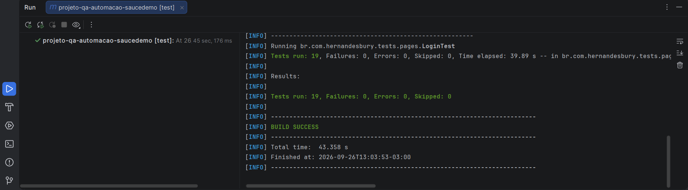

# Projeto QA Automação - SauceDemo

Projeto prático de automação de testes web desenvolvido com Java, Selenium WebDriver, JUnit 5 e Maven, aplicado à plataforma SauceDemo.

## 🎯 Objetivo

Automatizar cenários funcionais da aplicação, validando os principais fluxos de utilização:

- Login
- Produtos
- Carrinho
- Checkout

O projeto foi desenvolvido com foco na aplicação de práticas de automação de testes, organização do código e execução de cenários funcionais.

## 🛠️ Tecnologias utilizadas

- Java
- Selenium WebDriver
- JUnit 5
- Maven
- Google Chrome
- IntelliJ IDEA

## 📁 Estrutura do projeto

```text
src/
└── test/
    └── java/
        └── br.com.hernandesbury.tests.pages/
            ├── LoginPage.java
            ├── LoginTest.java
            └── ProductsPage.java


## 📊 Evidências da execução

Execução dos testes automatizados no IntelliJ IDEA:


